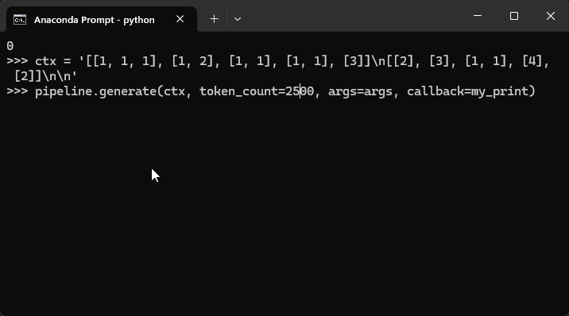
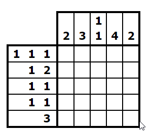

# RWKV-nonogram
A 20M RWKV v6 can do nonogram

[Nonograms](https://en.wikipedia.org/wiki/Nonogram) / [数织](https://zh.wikipedia.org/wiki/%E6%95%B8%E7%B9%94) are picture logic puzzles in which cells in a grid must be colored or left blank according to numbers at the edges of the grid to reveal a hidden picture. In this puzzle, the numbers are a form of discrete tomography that measures how many unbroken lines of filled-in squares there are in any given row or column. 

数织是一种逻辑游戏，以猜谜的方式绘画黑白位图。在一个网格中，每一行和列都有一组数，玩家需根据它们来填满或留空格子，最后就可以由此得出一幅图画。例如，“4 8 3”的意思就是指该行或列上有三条独立的线，分别占了4、8和3格，而每条线最少要由一个空格分开。传统上，玩家是以黑色填满格子，和以“×”号标记一定不需要填充的格子。数织是一个NP完全的问题。

You can play nonogram at [here](https://www.puzzle-nonograms.com/).

**Try RWKV-nonogram at [Colab](https://colab.research.google.com/drive/1HZnIlu4U56vk1ECLLVoQkdrwRdMEn_gZ?usp=sharing)** 

# V1

Our 20M RWKV v6 can do 5x5 nonograms (for v1 version) like:



Put the above process into a more intuitive way:



*this test sample are not in the train dataset*

# How to run this

`rwkv-11.pth` is the weighs file.((N_LAYER=12,N_EMBD=384))

`rwkv_vocab_nonogram.txt` is the vocab file.

```
pip install rwkv
```
